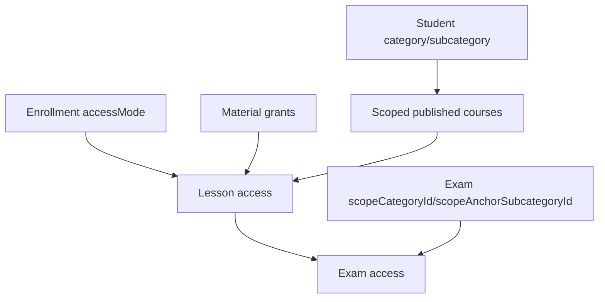

# Student Content Endpoints (Mobile)

This document lists the mobile-facing endpoints that return student content assigned by admin through dashboard scope (`categoryId` / `subcategoryId`), including courses, videos/files (lessons), and exams.

Primary sources:
- `backend/src/modules/mobile/mobile.routes.js`
- `backend/src/modules/mobile/mobile.controller.js`
- `backend/src/modules/mobile/mobile.service.js`
- `backend/src/shared/services/materialAccess.service.js`

## Scope-Based Assignment Behavior

- Student profile scope is stored on user: `categoryId`, `subcategoryId`.
- Scoped content is automatically visible to the student when:
  - course `categoryId` matches student `categoryId`
  - and if student has `subcategoryId`, course `subcategoryId` matches it.
- Access precedence used in content checks:
  1. Free lesson (`isFree`)
  2. Full enrollment (`accessMode = full`)
  3. Grants-only enrollment (`accessMode = grants_only` + grant exists)
  4. Scope match by category/subcategory (new behavior)
  5. Explicit material grants



---

## 1) My Student Content Feed (Courses)

### Endpoint
- `GET /api/enrollments`
- Backend target: `GET /enrollments` (mobile route `GET /enrollments` with auth)

### Purpose
Returns student course feed as:
- real enrollments
- plus scope-assigned published courses (category/subcategory) when status is not `completed`

### Auth
- Required (`authMiddleware`)

### Request
- Query:
  - `status`: `all | in_progress | completed` (default `all`)
  - `page`: number (default `1`)
  - `per_page`: number (default `20`)

Example:
```http
GET /api/enrollments?status=all&page=1&per_page=20
Cookie: token=...
```

### Success Response (shape)
```json
{
  "success": true,
  "data": {
    "courses": [
      {
        "id": "enrollment-id-or-scope-courseId",
        "course": {
          "id": "course-id",
          "title": "Course title"
        },
        "progress": 0,
        "completed_lessons": 0,
        "total_lessons": 12,
        "enrolled_at": null,
        "status": "in_progress"
      }
    ],
    "enrollments": [],
    "meta": {
      "total_enrolled": 3,
      "in_progress": 3,
      "completed": 0
    }
  }
}
```

### Error Cases
- `401` unauthorized

### Access Rule Note
- Courses appear even without manual enrollment if student profile scope matches course scope.

---

## 2) Course Details (Curriculum with Video/File Lesson Lock State)

### Endpoint
- `GET /api/courses/:id`
- Backend mobile route: `GET /courses/:id` (optional auth)

### Purpose
Returns full course details and curriculum, including lesson lock/unlock and media URLs.

### Auth
- Optional (`optionalAuthMiddleware`)
- If authenticated, response includes personalized `is_enrolled`, `progress`, and lesson lock state.

### Request
Path params:
- `id`: course id

Example:
```http
GET /api/courses/COURSE_ID
Cookie: token=... (optional but recommended)
```

### Success Response (key fields)
```json
{
  "success": true,
  "data": {
    "id": "course-id",
    "title": "Course",
    "is_enrolled": true,
    "progress": 35,
    "curriculum": [
      {
        "id": "section-id",
        "title": "Section",
        "lessons": [
          {
            "id": "lesson-id",
            "type": "video",
            "is_free": false,
            "is_locked": false,
            "video_url": "https://... or youtube URL",
            "content": "..."
          }
        ]
      }
    ]
  }
}
```

### Error Cases
- `404` course not found

### Access Rule Note
- `is_enrolled` may become true from scope-based assignment (not only enrollment row), grants, or enrollment.

---

## 3) Lesson Details (Videos / Files / Books)

### Endpoint
- `GET /api/courses/:courseId/lessons/:lessonId`
- Backend mobile route: `GET /courses/:courseId/lessons/:lessonId`

### Purpose
Returns lesson metadata and media content pointers when student has access.

### Auth
- Required

### Request
Path params:
- `courseId`
- `lessonId`

Example:
```http
GET /api/courses/COURSE_ID/lessons/LESSON_ID
Cookie: token=...
```

### Success Response (key fields)
```json
{
  "success": true,
  "data": {
    "id": "lesson-id",
    "title": "Lesson",
    "type": "video",
    "video_url": "https://...",
    "youtube_id": null,
    "content_pdf_url": null,
    "resources": [],
    "navigation": {
      "prev_lesson_id": null,
      "next_lesson_id": "next-id"
    }
  }
}
```

### Error Cases
- `403` not allowed (`غير مصرح لك بالوصول لهذا الدرس`)
- `404` lesson not found

---

## 4) Lesson Content Payload Endpoint

### Endpoint
- `GET /api/courses/:courseId/lessons/:lessonId/content`
- Backend mobile route: `GET /courses/:courseId/lessons/:lessonId/content`

### Purpose
Returns consumable lesson content payload for player/reader screens.

### Auth
- Required

### Request
Same params as lesson details.

### Success Response (example)
```json
{
  "success": true,
  "data": {
    "lesson_id": "lesson-id",
    "type": "file",
    "video_url": null,
    "content_pdf_url": "https://a-plus.anmka.com/uploads/...",
    "content": "...",
    "resources": []
  }
}
```

### Error Cases
- `403` locked
- `404` lesson missing

---

## 5) Course Exams List (Scoped Access Applied)

### Endpoint
- `GET /api/courses/:courseId/exams`
- Backend mobile route: `GET /courses/:courseId/exams`

### Purpose
Returns active course exams the student can access.

### Auth
- Optional in route, but access filtering is applied when user context exists.

### Request
Path params:
- `courseId`

Example:
```http
GET /api/courses/COURSE_ID/exams
Cookie: token=...
```

### Success Response (example)
```json
{
  "success": true,
  "data": [
    {
      "id": "exam-id",
      "title": "Final Exam",
      "course_id": "course-id",
      "questions_count": 30,
      "duration_minutes": 45,
      "passing_score": 70,
      "max_attempts": 3,
      "attempts_used": 1,
      "best_score": 82,
      "is_passed": true,
      "can_start": true
    }
  ]
}
```

### Error Cases
- `404` course not found

### Access Rule Note
- Exam visibility is filtered by `studentCanAccessExam`, which now supports scoped access rules.

---

## 6) Exam Details

### Endpoint
- `GET /api/courses/:courseId/exams/:examId`
- Backend mobile route: `GET /courses/:courseId/exams/:examId`

### Purpose
Returns exam metadata and question list (without correct answers).

### Auth
- Optional in route; if authenticated and forbidden, returns `403`.

### Request
Path params:
- `courseId`
- `examId`

### Success Response (example)
```json
{
  "success": true,
  "data": {
    "id": "exam-id",
    "title": "Midterm",
    "questions_count": 20,
    "duration_minutes": 30,
    "passing_score": 70,
    "attempts_used": 0,
    "can_start": true,
    "questions": [
      {
        "id": "q1",
        "text": "Question?",
        "type": "multiple_choice",
        "options": ["A", "B"],
        "points": 1,
        "order": 1
      }
    ]
  }
}
```

### Error Cases
- `403` forbidden for this exam
- `404` exam not found

---

## 7) Start Exam Attempt

### Endpoint
- `POST /api/courses/:courseId/exams/:examId/start`
- Backend mobile route: `POST /courses/:courseId/exams/:examId/start`

### Purpose
Creates or starts an exam attempt for the authenticated student.

### Auth
- Required

### Request
Path params: `courseId`, `examId`  
Body: empty

### Success Response (delegated from exams service)
```json
{
  "success": true,
  "data": {
    "attempt_id": "attempt-id",
    "exam_id": "exam-id",
    "started_at": "2026-04-19T10:00:00.000Z",
    "ends_at": "2026-04-19T10:45:00.000Z",
    "duration_minutes": 45,
    "questions": [
      {
        "id": "question-id",
        "order": 1,
        "question": "Question text",
        "question_type": "multiple_choice",
        "options": [
          { "id": "opt_0", "text": "A" }
        ],
        "points": 1
      }
    ]
  }
}
```

### Error Cases
- `404` exam not found
- `400` cannot start (max attempts, forbidden, invalid state)

---

## 8) Submit Exam Attempt

### Endpoint
- `POST /api/courses/:courseId/exams/:examId/submit`
- Backend mobile route: `POST /courses/:courseId/exams/:examId/submit`

### Purpose
Submits answers and returns result summary.

### Auth
- Required

### Request
Body:
- `attempt_id` (string, required)
- `answers` (array, required)

Example:
```json
{
  "attempt_id": "attempt-id",
  "answers": [
    { "questionId": "q1", "answer": "A" }
  ]
}
```

### Success Response (example)
```json
{
  "success": true,
  "data": {
    "attempt_id": "attempt-id",
    "score": 16,
    "percentage": 80,
    "passing_score": 70,
    "is_passed": true,
    "correct_answers": 16,
    "total_questions": 20,
    "time_taken_minutes": 12,
    "certificate_unlocked": false,
    "message": "أحسنت! لقد اجتزت الامتحان بنجاح"
  }
}
```

### Error Cases
- `400` missing `attempt_id` or invalid `answers` payload
- `400` submit failed by exam service validation

---

## Notes for Integrators

- All endpoints use standard envelope:  
  `{"success": boolean, "data": any, "message"?: string}`.
- Category/subcategory assignment comes from student profile and is now used in:
  - course feed (`/api/enrollments`)
  - material access checks for lessons and exams.
- Progress mutation endpoints still require authenticated user and pass through lock checks before writing progress.
